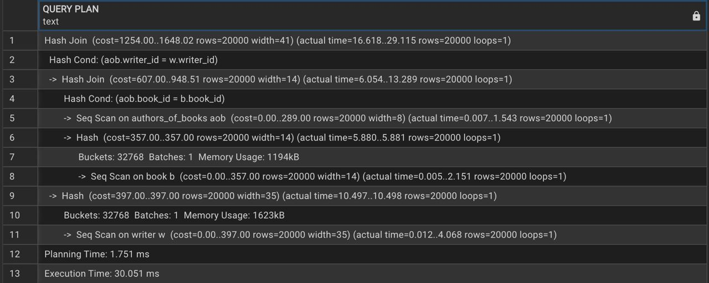
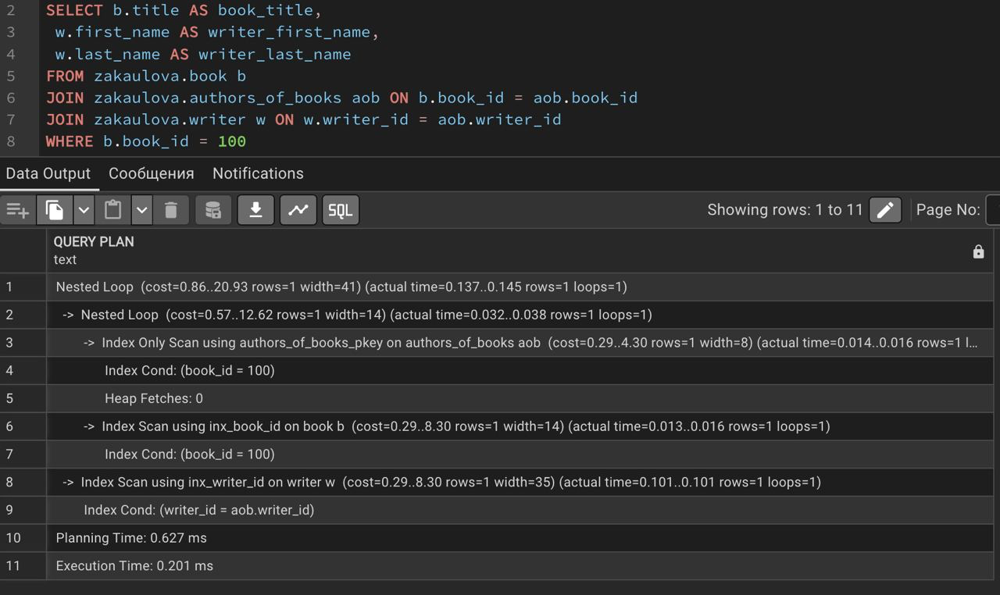

# Лабораторная работа №4

**Тема:** Анализ производительности
**Цель:** Освоение методов анализа и оптимизации производительности БД

## Задачи лабораторной работы

1. Создание генератора данных (по 20 000 записей в каждой таблице)
2. Анализ планов выполнения запросов (**EXPLAIN ANALYZE**)
3. Оптимизация БД через индексы и настройки
4. Сравнение производительности до и после оптимизации

---


## Генерация данных

Для анализа производительности было необходимо создать большое количество записей. Использовался `generate_series` и функции `random()` и `concat()` для генерации 20 000 записей в таблицах:

```sql
-- Библиотеки
INSERT INTO zakaulova.library(library_id, name, address, email)
SELECT id, concat('library № ', id), concat('street ', id), concat('library', id, '@gmail.com') 
FROM generate_series(4,20000) AS id;

-- Авторы
INSERT INTO zakaulova.writer(writer_id, first_name, last_name, country)
SELECT id, concat('first_name ', id), concat('last_name ', id), concat('country ', id / 10) 
FROM generate_series(7,20000) AS id;

-- Клиенты
INSERT INTO zakaulova.customer(customer_id, first_name, last_name, email, date_of_birth)
SELECT 
    id, 
    concat('first_name ', id), 
    concat('last_name ', id), 
    concat('customer', id, '@gmail.com'), 
    ('1940-01-01'::date + trunc(random() * (('2020-12-31'::date - '1940-01-01'::date)))::int)
FROM generate_series(5,20000) AS id;

-- Книги
INSERT INTO zakaulova.book(book_id, title, genre, year_of_publication, library_id)
SELECT 
    id, concat('book ', id), concat('genre ', id / 24), 
    (floor(random() * (2025 - 1200 + 1) + 1200)::int),
    (floor(random() * 20000 + 1)::int)
FROM generate_series(10, 20000) AS id;

-- Связь авторов с книгами
INSERT INTO zakaulova.authors_of_books(book_id, writer_id)
SELECT 
    id, 
    (floor(random() * 20000 + 1)::int)
FROM generate_series(10, 20000) AS id;

-- Бронирования
WITH generated AS (
    SELECT 
        id,
        floor(random() * 20000 + 1)::int AS customer_id,
        floor(random() * 20000 + 1)::int AS book_id,
        ('2020-01-01'::date + trunc(random() * (('2025-10-01'::date - '2020-01-01'::date)))::int) AS start_date
    FROM generate_series(6, 20000) AS id
)
INSERT INTO zakaulova.reservation(reservation_id, customer_id, book_id, start_date, end_date)
SELECT 
    id,
    customer_id,
    book_id,
    start_date,
    start_date + (floor(random() * (365 - 3 + 1) + 3)::int) * interval '1 day'
FROM generated;
```

**Описание:**

* Каждая таблица получила 20 000 записей.
* Использованы случайные данные для имитации реальных пользователей, книг, авторов и бронирований.
* Это позволило провести нагрузочное тестирование запросов и анализ планов выполнения.

---

## Анализ производительности до оптимизации

```sql
EXPLAIN ANALYZE 
SELECT b.title AS book_title,
       w.first_name AS writer_first_name,       
       w.last_name AS writer_last_name
FROM zakaulova.book b
JOIN zakaulova.authors_of_books aob ON b.book_id = aob.book_id
JOIN zakaulova.writer w ON w.writer_id = aob.writer_id
WHERE b.book_id = 100;
```

**Результат (до создания индексов):**

* Запрос использовал **Hash Join** и последовательное сканирование (`Seq Scan`) по всем таблицам: `book`, `authors_of_books`, `writer`.
* `actual time` для выполнения запроса составило ~30 мс.
* План показал, что поиск по большому объёму данных выполняется полностью по всей таблице, что увеличивает время выполнения.



---

## Создание индексов для оптимизации

```sql
CREATE INDEX inx_writer_id ON zakaulova.writer (writer_id);
CREATE INDEX inx_book_id ON zakaulova.book (book_id);
CREATE INDEX inx_aob_book_id ON zakaulova.authors_of_books (book_id);
CREATE INDEX inx_aob_writer_id ON zakaulova.authors_of_books (writer_id);
CREATE INDEX inx_book_title ON zakaulova.book (title);
```

**Описание:**

* Индексы созданы на ключевых столбцах, участвующих в соединениях и фильтрах:

  * `writer_id` и `book_id` для ускорения JOIN операций.
  * `title` для быстрого поиска по названию книги.
* Это позволяет базе данных использовать **Index Scan** вместо полного последовательного сканирования.

---

## Анализ производительности после оптимизации

```sql
EXPLAIN ANALYZE 
SELECT b.title AS book_title,
       w.first_name AS writer_first_name,       
       w.last_name AS writer_last_name
FROM zakaulova.book b
JOIN zakaulova.authors_of_books aob ON b.book_id = aob.book_id
JOIN zakaulova.writer w ON w.writer_id = aob.writer_id
WHERE b.book_id = 100;
```

**Результат (после создания индексов):**

* Запрос использовал **Index Scan** и **Nested Loop**, что позволило избежать полного сканирования таблиц.
* `actual time` снизилось до ~0.2 мс — значительное ускорение.
* План выполнения стал более эффективным: каждая таблица ищется по индексу, что минимизирует количество операций.



---

## Итог лабораторной работы

- Генерация большого объёма тестовых данных позволяет эффективно проверять производительность запросов. 
- До оптимизации запросы выполнялись с использованием полного сканирования таблиц, что замедляло работу при больших объёмах данных.
- Создание индексов на ключевых полях для JOIN и фильтров сильно улучшает производительность запросов.
- После оптимизации EXPLAIN ANALYZE показал значительное снижение времени выполнения — с ~30 мс до ~0.2 мс.
- Лабораторная работа продемонстрировала важность индексирования и анализа планов выполнения для оптимизации производительности базы данных.

---
