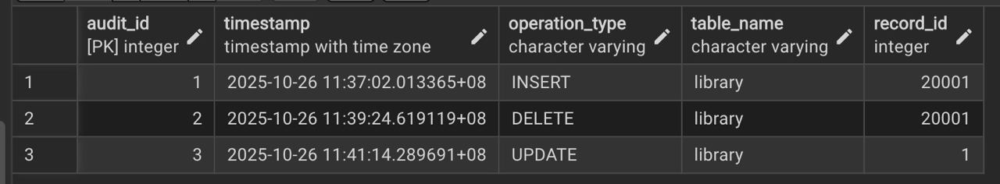
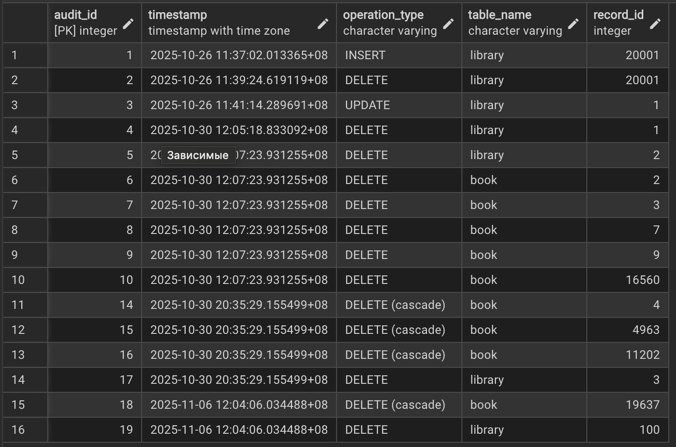

# Лабораторная работа №5

**Тема:** Триггеры и аудит
**Цель:** Реализация бизнес-логики на уровне БД и системы аудита

## Задачи лабораторной работы

1. Триггеры каскадного удаления для связей “один-ко-многим”
2. Триггеры аудита изменений (`INSERT`, `UPDATE`, `DELETE`)
3. Создание таблицы-журнала для отслеживания изменений

---

## Создание таблицы аудита

```sql
CREATE TABLE zakaulova.audit (
 audit_id SERIAL PRIMARY KEY,
 timestamp TIMESTAMP WITH TIME ZONE DEFAULT NOW(),
 operation_type VARCHAR,
 table_name VARCHAR,
 record_id INT
);
```

**Что происходит:**

* Создаём таблицу `audit` для хранения событий изменения данных.
* Поля:

  * `audit_id` — уникальный идентификатор записи (автоинкремент, `SERIAL`).
  * `timestamp` — время изменения, автоматически ставится текущая дата и время (`NOW()`).
  * `operation_type` — тип операции: `INSERT`, `UPDATE`, `DELETE`.
  * `table_name` — имя таблицы, в которой произошло изменение.
  * `record_id` — идентификатор записи, которая изменилась.

**Зачем:**

* Таблица нужна для реализации **аудита изменений**, чтобы фиксировать все важные действия с данными.

---

## Функция триггера для аудита изменений

```sql
CREATE OR REPLACE FUNCTION zakaulova.process_audit()
RETURNS TRIGGER AS $log_changes$
DECLARE
    pk_column_name TEXT;
    record_json JSON;
    pk_value BIGINT;
BEGIN
    -- Определяем имя первичного ключа текущей таблицы
    SELECT pg_attribute.attname
    INTO pk_column_name
    FROM pg_index
    JOIN pg_attribute 
        ON pg_attribute.attrelid = pg_index.indrelid 
       AND pg_attribute.attnum = ANY(pg_index.indkey)
    WHERE pg_index.indrelid = TG_RELID 
      AND pg_index.indisprimary
    LIMIT 1;

    -- Формируем JSON объекта записи
    IF TG_OP = 'INSERT' THEN
        record_json := row_to_json(NEW);
    ELSE
        record_json := row_to_json(OLD);
    END IF;

    -- Получаем значение первичного ключа записи
    pk_value := (jsonb_extract_path_text(record_json::jsonb, pk_column_name))::BIGINT;

    -- Вставляем событие в таблицу аудита
    INSERT INTO zakaulova.audit (timestamp, operation_type, table_name, record_id)
    VALUES (now(), TG_OP, TG_TABLE_NAME, pk_value);

    RETURN NULL;
END;
$log_changes$ LANGUAGE plpgsql;
```

**Что происходит:**

1. **Определение первичного ключа таблицы:**

   * Используем системные таблицы PostgreSQL (`pg_index`, `pg_attribute`) для поиска имени столбца первичного ключа.
   * `TG_RELID` — идентификатор таблицы, на которую срабатывает триггер.
   * `attname` — имя столбца первичного ключа.

2. **Формирование JSON записи:**

   * Если операция `INSERT`, берём данные из `NEW` — новой строки.
   * Если `UPDATE` или `DELETE`, берём данные из `OLD` — предыдущей версии строки.
   * Это позволяет работать с любыми таблицами без явного указания полей.

3. **Извлечение значения первичного ключа:**

   * Преобразуем JSON в `jsonb` и достаём значение по ключу `pk_column_name`.
   * Это значение будет использоваться как `record_id` в журнале аудита.

4. **Запись события в аудит:**

   * Вставляем текущую метку времени (`now()`), тип операции (`TG_OP`), имя таблицы (`TG_TABLE_NAME`) и `record_id`.

**Зачем:**

* Функция универсальна для всех таблиц с первичным ключом.
* Позволяет отслеживать все изменения без необходимости писать отдельный код для каждой таблицы.

---

## Триггер для аудита изменений таблицы `library`

```sql
CREATE OR REPLACE TRIGGER audit_library_changes
    AFTER INSERT OR UPDATE OR DELETE ON zakaulova.library
    FOR EACH ROW EXECUTE FUNCTION zakaulova.process_audit();
```

**Что происходит:**

* Создаём триггер `audit_library_changes` на таблицу `library`.
* Срабатывает **после каждой операции** `INSERT`, `UPDATE` или `DELETE`.
* Для каждой строки (`FOR EACH ROW`) вызывается функция `process_audit()`.

**Зачем:**

* Любое изменение данных в таблице `library` автоматически фиксируется в таблице `audit`.



---


## Функция каскадного удаления с аудитом

```sql
CREATE OR REPLACE FUNCTION zakaulova.delete_library_with_audit()
RETURNS TRIGGER AS $$
DECLARE
    book_rec RECORD;
BEGIN
    -- Для каждой книги, связанной с удаляемой библиотекой:
    FOR book_rec IN 
        SELECT * FROM zakaulova.book WHERE library_id = OLD.library_id
    LOOP
        -- Записываем событие удаления книги в аудит
        INSERT INTO zakaulova.audit (timestamp, operation_type, table_name, record_id)
        VALUES (now(), 'DELETE (cascade)', 'book', book_rec.book_id);
        
        -- Удаляем книгу
        DELETE FROM zakaulova.book WHERE book_id = book_rec.book_id;
    END LOOP;

    RETURN OLD;
END;
$$ LANGUAGE plpgsql;
```

**Что происходит:**

1. При удалении библиотеки нужно удалить все связанные книги (**каскадное удаление**).
2. Для каждой книги, где `library_id` совпадает с удаляемой библиотекой:

   * Сначала записываем событие удаления в таблицу `audit` с пометкой `'DELETE (cascade)'`.
   * Затем выполняем фактическое удаление книги.
3. Возвращаем `OLD`, чтобы триггер продолжил выполнение операции удаления библиотеки.

**Зачем:**

* Гарантирует, что все каскадные удаления фиксируются в журнале аудита.
* Поддерживает целостность данных: при удалении библиотеки удаляются связанные книги.

---

## Триггер каскадного удаления

```sql
CREATE OR REPLACE TRIGGER trg_delete_library_with_audit
BEFORE DELETE ON zakaulova.library
FOR EACH ROW EXECUTE FUNCTION zakaulova.delete_library_with_audit();
```

**Что происходит:**

* Создаём триггер `trg_delete_library_with_audit` на таблицу `library`.
* Срабатывает **перед удалением строки** (`BEFORE DELETE`).
* Вызывает функцию `delete_library_with_audit()`, которая:

  * Удаляет все книги библиотеки.
  * Записывает каскадные удаления в таблицу `audit`.

**Зачем:**

* Позволяет реализовать бизнес-логику **каскадного удаления** на уровне базы данных.
* Все операции фиксируются в журнале аудита.


---

## Итог лабораторной работы

1. Таблица `audit` обеспечивает централизованный журнал изменений для всех операций `INSERT`, `UPDATE` и `DELETE`.
2. Функция `process_audit()` универсальна и автоматически определяет первичный ключ любой таблицы.
3. Триггер `audit_library_changes` фиксирует все изменения библиотеки.
4. Функция `delete_library_with_audit()` и триггер `trg_delete_library_with_audit` обеспечивают каскадное удаление связанных записей и их аудит.
5. Реализованная система позволяет **контролировать целостность данных** и вести полноценный аудит действий пользователей на уровне базы данных.

---
